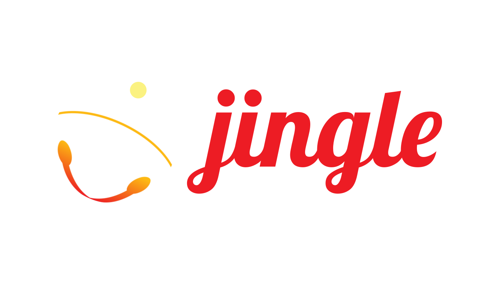

<div align="center">



🎶 <span style="font-style: italic; font-family: serif">Jingle bells, Jingle bells, Jingle all the `SLEIGH`</span> 🎶

</div>

# `jingle`: SMT Modeling for `p-code`
`jingle` is a library that translates (a fragment of) Ghidra's `p-code` into SMT. It allows expressing symbolic state
of the pcode vm and the relational semantics between those states defined by `p-code` operations.

**I am writing in the course of my PhD work and it is still very much "in flux". Breaking changes may happen at any time
and the overall design may change too.**

The API is currently a bit of a mess because I've been trying out different approaches to figure out what I like (e.g. 
traits vs context objects). I hope to clean it up at some point and expose one right way to do things.

This repository contains a [Cargo Workspace](https://doc.rust-lang.org/book/ch14-03-cargo-workspaces.html) for two
related crates:

* [`jingle_sleigh`](./jingle_sleigh): a Rust FFI in front of [Ghidra](https://github.com/NationalSecurityAgency/ghidra)'
  s
  code translator: `SLEIGH`. `SLEIGH` is written in C++ and can be
  found [here](https://github.com/NationalSecurityAgency/ghidra/tree/master/Ghidra/Features/Decompiler/src/decompile/cpp).
  This crate contains a private internal low-level API to `SLEIGH` and exposes an idiomatic high-level API to consumers.
* [`jingle`](./jingle): a set of functions built on top of `jingle_sleigh` that defines an encoding of `p-code` operations
  into SMT. `jingle` is currently
  designed for providing formulas for use in decision procedures over individual program traces. As such, it does not yet
  expose APIs for constructing or reasoning about control-flow graphs. A more robust analysis
  is forthcoming, depending on my research needs.

## Usage

In order to use `jingle`, include it in your `Cargo.toml` as usual:

```toml
jingle = { git = "ssh://git@github.com/toolCHAINZ/jingle", branch = "main" }
```

Again, this project is under active development an is still of "research quality" so it would probably make sense to
target
a tag or individual commit. I expect I will eventually put this on crates.io.